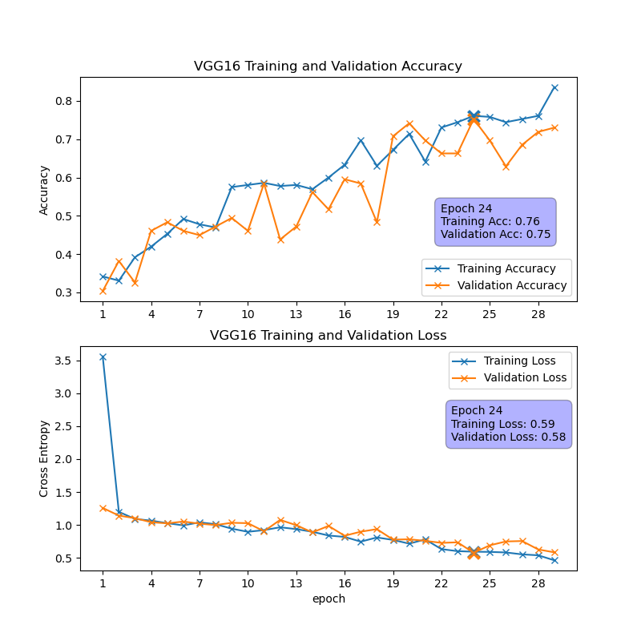
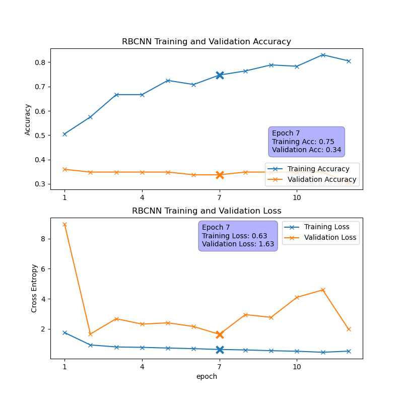
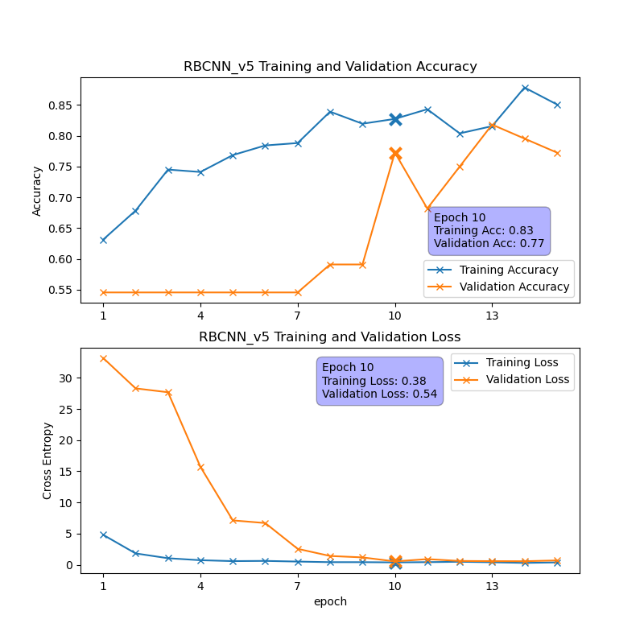

# Convolutional Neural Network (CNN) Project

## Introduction

This project focuses on building and training Convolutional Neural Networks (CNNs) to classify images into categories. TensorFlow and Keras libraries are utilized, and the dataset consists of images of religious buildings like churches, mosques, and temples.

---

## Data Preparation

### Loading the Dataset

The dataset contains images of three classes: churches, mosques, and temples. Load these images from the directory and split them into training and validation sets.

### Dataset Summary
- **Total images:** 449
- **Training images:** 360
- **Validation images:** 89

---

## Model Building

### 1. **Simple CNN Model**

A basic CNN model is constructed with the following layers:
- **Conv2D -> MaxPooling -> Conv2D -> MaxPooling -> Conv2D -> MaxPooling -> Flatten -> Dense -> Dropout -> Dense -> Softmax**
- The model is trained for 30 epochs with early stopping to prevent overfitting.

### 2. **VGG16**
- Using VGG16, a pre-trained model on ImageNet, we build a more robust model by adding custom layers to the VGG16 base.
- The model is trained for 30 epochs with early stopping.

### 3. **Residual Building CNN (RBCNN)**

- A deeper model inspired by ResNet is built to improve performance. This model incorporates residual connections to mitigate the risk of vanishing gradients.

**Model Architecture**
1. Implement a residual function every  two Conv2D layers.
2. Double the number of filters after a MAxPooling layer.

- 5 Versions are made to improve performance.

---

## Conclusion

- Simple CNN Model achieved moderate accuracy but struggled with overfitting.
- VGG16 Transfer Learning improved performance but still had some issues with validation accuracy.
- RBCNN Model showed the most promise with better accuracy, but further improvements could be made.

- Future work could include more extensive data augmentation, experimenting with different architectures, and exploring techniques like learning rate schedules or advanced regularization to further enhance model performance. In addition, it is highly encouraged to obtain more photos to train the RBCNN model. With more training images available, we expect the model could perform better.

